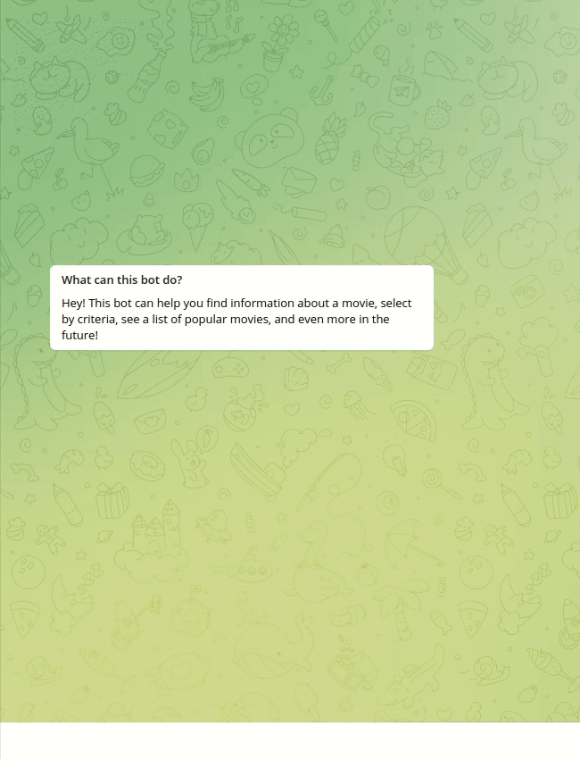

# TMDBMovieBotTelegram
Powered by **aiogram**, **TMDB API** and **tmdbv3api** libary.

This Telegram Bot can help to find movies by criteria as like: 
- genre
- vote average
- release year

Search movies by title.

You can find info about popular films on **TMDB**. This list refreshes every day.

Also, you can watch info on **TMDB** site, and watch trailers on **YouTube**.

- Run **app.py** for using this Bot 
- All configurations in file **config.py**
- Tokens and Keys for **configurations** are stored in a file **.env**

**[Telegram link](https://t.me/IFITWILLWORKILEAVETHISNAMEOFBOT)**

